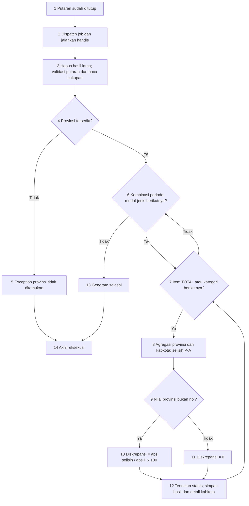

# White Box Testing Generate Konserda Setelah Putaran Ditutup

Tanggal bukti pengujian: 6 Oktober 2026.

## 1. Ruang lingkup dan penyederhanaan

Pengujian dimulai ketika putaran sudah berstatus selesai dan tanggal_selesai terisi, lalu mengikuti job hingga pembentukan hasil dan detail Konserda. Pemeriksaan login/role dan validasi sebelum penutupan berada di luar titik awal grafik.

Sumber kode: `RekonsiliasiController::tutup()`, `GenerateKonserdaJob::handle()`, `KonserdaService::generate()`, `cekStatusTotal()`, dan `cekStatusKategori()`.

Grafik disederhanakan dari 40 menjadi **14 simpul** dengan abstraksi berikut:

- Tiga loop periode, modul, dan jenis tabel menjadi satu loop kombinasi.
- Perhitungan total dan kategori memakai satu pola pengolahan item. Item pertama adalah TOTAL, kemudian semua kategori sesuai modul.
- Pemilihan model/kategori dimasukkan ke proses persiapan kombinasi.
- Klasifikasi status dan loop penyimpanan detail kabkota menjadi satu simpul subproses.

Ini flowgraph proses pada tingkat ringkas, bukan representasi satu-ke-satu setiap keputusan PHP. Kode dan hasil uji tidak berubah karena penyederhanaan gambar.

## 2. Flowgraph tunggal: 14 simpul



Simpul 6 juga mencakup pembacaan kabkota anak provinsi dan pemilihan kategori/model untuk kombinasi yang sedang diproses. Kombinasi meliputi setiap periode terkait rekonsiliasi, modul lapangan usaha/pengeluaran, dan ADHB/ADHK.

Simpul 7 memproses TOTAL terlebih dahulu, kemudian kategori. Ini penyatuan konseptual dua bagian kode; implementasi asli tetap menghitung TOTAL sebelum foreach kategori. Daftar item selalu mempunyai TOTAL, sehingga cabang langsung kosong pada iterasi pertamanya infeasible. Keluar setelah semua item selesai tetap feasible.

Simpul 12 merangkum klasifikasi dan penyimpanan. Untuk TOTAL, batas aman 2 persen; untuk kategori 5 persen. Keduanya ekstrem mulai 10 persen. Detail disimpan hanya untuk kabkota anak provinsi yang ditemukan.

Pada queue async, simpul 2 dapat menunggu worker sebelum handle berjalan; waktu menunggu tidak digambarkan sebagai keputusan kode. K26 membuktikan hasil belum ada ketika job pending, kemudian terbentuk setelah worker berjalan.

Simpul 13 berarti service selesai, termasuk ketika periode kosong; bukan jaminan ada baris hasil. Simpul 14 adalah akhir eksekusi sukses atau exception yang ditampilkan. Exception implicit findOrFail/database tidak diperluas. Status selesai merupakan prasyarat konteks, bukan guard dalam generate().

## 3. Kompleksitas dan jalur uji

Grafik ringkas memiliki N=14 simpul, E=17 edge, dan empat keputusan eksplisit pada simpul 4, 6, 7, dan 9.

`V(G) = E - N + 2 = 17 - 14 + 2 = 5`.

Pemeriksaan alternatif: `V(G) = D + 1 = 4 + 1 = 5`.

**V=5 hanya berlaku untuk model ringkas.** Kompleksitas kode generate() tetap V=11. Bila cabang kedua helper status diperluas ke model gabungan, V=15. Penggabungan subproses tidak mengurangi kompleksitas implementasi asli dan tidak membuktikan coverage cabang penuh.

| Jalur model | Lintasan | Kondisi | Bukti |
|---|---|---|---|
| P1 | 1-2-3-4-5-14 | Provinsi tidak ditemukan | K21, service diuji langsung |
| P2 | 1-2-3-4-6-13-14 | Tidak ada periode/kombinasi | K22 |
| P3 | 1-2-3-4-6-7-6-13-14 | Loop item langsung kosong | Infeasible pada awal: TOTAL selalu ada |
| P4 | 1-2-3-4-6-7-8-9-11-12-7-...-6-13-14 | Pembagi provinsi nol | K16/K24 |
| P5 | 1-2-3-4-6-7-8-9-10-12-7-...-6-13-14 | Pembagi provinsi bukan nol | K07-K15/K18 |

Tanda ... berarti menyelesaikan item dan kombinasi berikutnya sebelum keluar. Daftar ini adalah basis struktural model ringkas; tidak mengklaim kelima jalur feasible. Klasifikasi yang tersembunyi di simpul 12 tetap diuji pada K07-K13; detail dan dua modul diuji K18, regenerasi K20, dan eksekusi job nyata K26.

Mayoritas kasus perhitungan memanggil service langsung. K26 membuktikan alur penutupan -> dispatch -> worker -> generate -> hasil. Tidak mengklaim seluruh jalur diuji end-to-end dari endpoint atau branch coverage terukur.

## 4. Rumus dan ekspektasi

P = nilai provinsi, A = jumlah kabkota yang parent_id-nya sama dengan provinsi terpilih.

- Selisih = P - A; tanda selisih tetap disimpan.
- Jika P bukan nol: diskrepansi = abs(P-A) / abs(P) x 100.
- Jika P nol: diskrepansi = 0 menurut kode saat ini.
- Total menjumlahkan kategori parent saja. Hasil kategori mencakup seluruh kategori, termasuk anak.
- Total: aman bila d<2; peringatan bila 2<=d<10; ekstrem bila d>=10.
- Kategori: aman bila d<5; peringatan bila 5<=d<10; ekstrem bila d>=10.
- Jenis tabel: ADHB (1) dan ADHK (2), pada modul lapangan usaha (1) dan pengeluaran (2).

## 5. Hasil pengujian aktual

Bukti diambil dari eksekusi 6 Oktober 2026 pada `docs/white-box-results.xml`, dengan test `tests/Feature/WhiteBoxPdrbTest.php`. Subset khusus G/Konserda adalah **K06-K27: 22 dataset, 203 assertion, seluruhnya lulus**. Ini subset hasil eksekusi sebelumnya, bukan klaim run baru atau kelas test yang terpisah.

| ID kasus | Kondisi | Hasil aktual yang diverifikasi | Status |
|---|---|---|---|
| K06 | Job membawa ID 17 | generate menerima ID 17 sekali, diuji mock | Lulus |
| K07 | Total P=1000, A=981 | 1.9 persen, aman | Lulus |
| K08 | Total P=1000, A=980 | 2 persen, peringatan | Lulus |
| K09 | Total P=1000, A=901 | 9.9 persen, peringatan | Lulus |
| K10 | Total P=1000, A=900 | 10 persen, ekstrem | Lulus |
| K11 | Kategori P=1000, A=951 | 4.9 persen, aman | Lulus |
| K12 | Kategori P=1000, A=950 | 5 persen, peringatan | Lulus |
| K13 | Kategori A=901 lalu 900 | 9.9 persen peringatan, 10 persen ekstrem | Lulus |
| K14 | P=1000, A=1100 | Selisih -100, 10 persen, ekstrem | Lulus |
| K15 | P=-1000, A=-900 | Selisih -100, 10 persen, ekstrem | Lulus |
| K16 | P=0, A=100 | Selisih -100, diskrepansi 0, aman | Lulus sesuai kode |
| K17 | Parent P=100 dan anak P=50 | Total P=100; hasil anak P=50; 16 hasil | Lulus |
| K18 | Dua modul, dua periode, dua jenis, dua kabkota | 32 hasil, 64 detail; nilai sesuai fixture | Lulus |
| K19 | Kabkota di luar parent provinsi | Tidak masuk agregasi/detail | Lulus |
| K20 | Regenerasi putaran sasaran | Hasil diperbarui; putaran lain tetap; tidak ada detail yatim | Lulus |
| K21 | Provinsi hilang saat regenerasi | Exception; hasil/detail lama sasaran sudah terhapus | Lulus sesuai kode |
| K22 | Periode rekonsiliasi kosong | Setelah penghapusan tidak terbentuk hasil baru | Lulus |
| K23 | Kabkota kosong, provinsi=100 | Agregasi 0, ekstrem; tidak ada detail | Lulus |
| K24 | Kategori satu modul kosong | Dua hasil TOTAL modul tersebut, nilai 0; tanpa hasil kategori | Lulus |
| K25 | Source provinsi 100 dan submission 50 | Konserda 150; pembanding integrasi 100 | Lulus sesuai kode |
| K26 | Putaran ditutup pada queue database, worker dijalankan kemudian | Putaran selesai; awal satu job dan nol hasil; setelah worker job habis dan 16 hasil | Lulus |
| K27 | Kegagalan service pada job sync | Exception; putaran tetap selesai, hasil belum ada | Lulus sesuai kode |

Dengan p periode, cL kategori lapus, cP kategori pengeluaran, dan k kabkota: jumlah hasil=`p x 2 x ((1+cL)+(1+cP))`; jumlah detail=jumlah hasil x k. Angka 1 berarti hasil TOTAL berkategori null. K18 menggunakan p=2, cL=cP=3, k=2 sehingga 32 hasil dan 64 detail.

Untuk menjalankan hanya subset tersebut kembali:

```powershell
php -d opcache.enable_cli=0 vendor/phpunit/phpunit/phpunit --filter 'WhiteBoxPdrbTest.*K(0[6-9]|1[0-9]|2[0-7])' --do-not-cache-result --log-junit docs/white-box-konserda-results.xml
```

Perintah di atas adalah petunjuk rerun; file XML terpisah tersebut belum dibuat oleh penyusunan dokumen ini. Bukti aktual saat ini tetap XML gabungan yang sudah tersedia.

## 6. Klaim dan batasnya

> Pada subset Generate Konserda, seluruh 22 dataset yang dijalankan lulus dengan 203 assertion pada fixture SQLite di memori. Pengujian membuktikan klasifikasi nilai batas, agregasi parent/kategori, detail kabkota, regenerasi berurutan, dan pembentukan hasil setelah worker memproses job pada kasus yang diuji.

Fixture memakai skema minimal, bukan semua constraint MySQL produksi. Belum ada instrumentasi coverage atau pembuktian semua basis path lengkap. Grafik ringkas memiliki V=5 pada tingkat abstraksinya; kode lengkap generate memiliki V=11, atau V=15 jika cabang kedua helper status diperluas. Angka tersebut bukan persentase coverage atau jumlah lintasan yang berhasil diobservasi.

Perilaku provinsi nol dianggap aman, penghitungan submission, penghapusan sebelum validasi provinsi, serta putaran tetap selesai saat job gagal telah dibuktikan sebagai perilaku kode saat ini. Kelulusan characterization test tidak mengesahkan perilaku itu sebagai aturan bisnis yang benar.

Flowgraph ini mengasumsikan penutupan sudah terjadi dan job akan dijalankan. Respons penutupan berhasil tidak otomatis berarti hasil sudah tersedia. Tidak ada transaksi menyeluruh pada generate yang menjamin seluruh hasil tersimpan secara atomik; skenario kegagalan di tengah beberapa insert belum diuji menyeluruh.