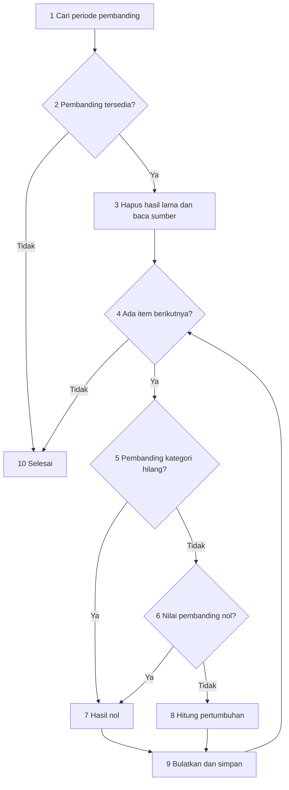
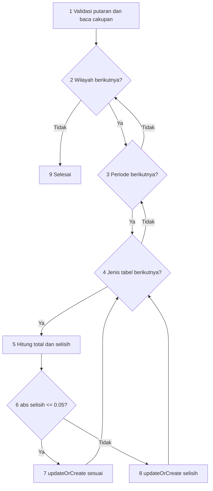
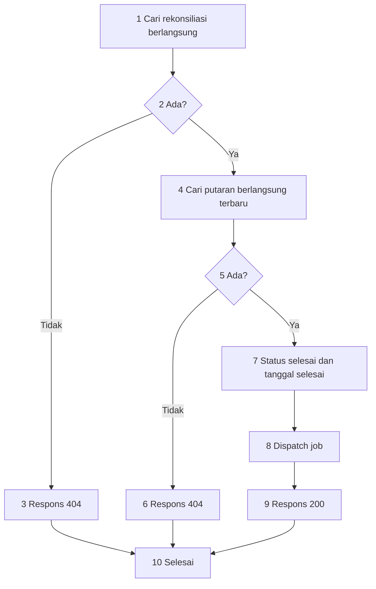
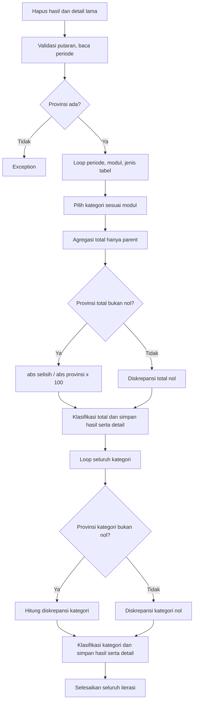
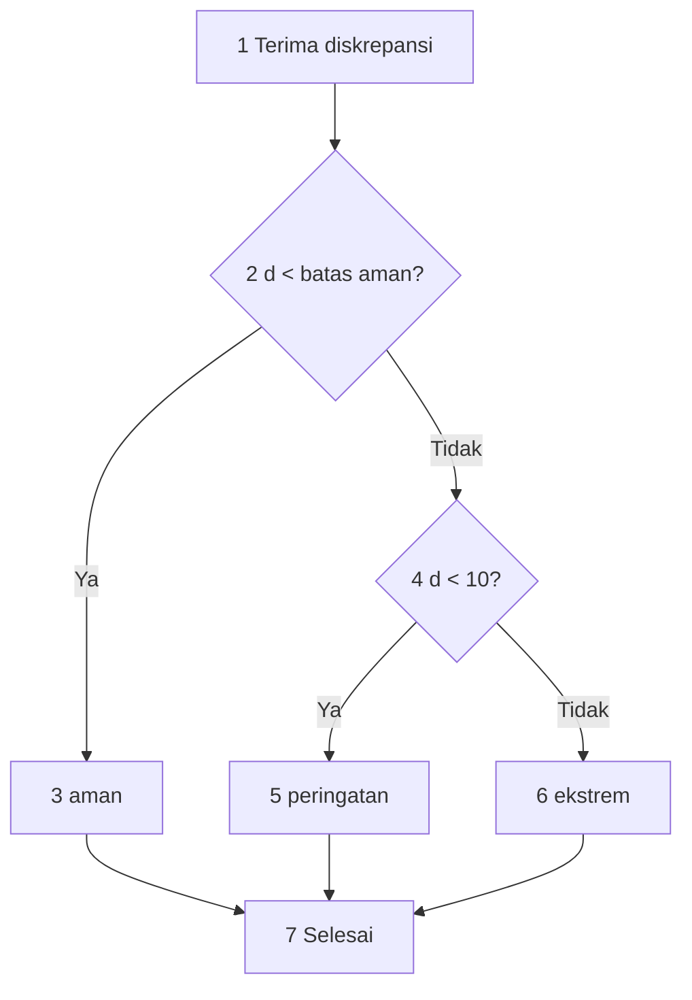

# White Box Testing ASIKBRO NG: Rancangan dan Hasil Aktual

Tanggal pengujian: **6 Oktober 2026** (Asia/Jakarta).

## 1. Hasil dan klaim pengujian

> Pada pengujian otomatis terhadap transformasi derived table, integrasi PDRB, serta penutupan putaran dan pembentukan Hasil Konserda, seluruh **91 pengujian** lulus dengan **728 assertion**, tanpa failure, error, atau kasus dilewati. Pengujian menjalankan service/controller asli menggunakan fixture SQLite di memori. Hasil ini membuktikan kesesuaian perilaku implementasi dengan ekspektasi pada kasus yang dijalankan; tidak membuktikan seluruh aturan bisnis benar, kompatibilitas penuh MySQL, atau coverage kode 100%.

| Kelompok | ID laporan | Eksekusi | Hasil |
|---|---|---:|---|
| Derived table | D01-D25, masing-masing pada modul 1 dan 2 | 50 | Lulus seluruhnya |
| Integrasi PDRB | I01-I13 | 13 | Lulus seluruhnya |
| Penutupan dan Konserda | K01-K28 | 28 | Lulus seluruhnya |
| Total | 66 ID rancangan | 91 | 91 lulus |

Bukti yang dapat diperiksa:

- Test: `tests/Feature/WhiteBoxPdrbTest.php`.
- Hasil mesin/JUnit: `docs/white-box-results.xml` (nama dataset, assertion, dan waktu setiap pengujian).
- Snapshot hash kode yang diuji: `docs/white-box-source-hashes.txt`.
- Commit dasar: `9ba971280d7704df171e6ffc37acbf685830aadd`; test dan laporan merupakan perubahan working tree di atas commit tersebut, belum otomatis di-commit.

Output akhir runner:

```text
PHPUnit 12.5.16
Runtime: PHP 8.5.0
Time: 00:09.242, Memory: 60.00 MB
OK (91 tests, 728 assertions)
```

## 2. Lingkungan, pelaksanaan, dan keterbatasan

Perintah yang dijalankan dari folder proyek:

```powershell
php -d opcache.enable_cli=0 vendor/phpunit/phpunit/phpunit --filter WhiteBoxPdrbTest --do-not-cache-result --log-junit docs/white-box-results.xml
```

Database diatur paksa dalam setUp menjadi SQLite `:memory:` dan koneksi SQLite dipurge sebelum fixture dibangun. Setiap dataset memiliki database baru. Assertion memastikan driver SQLite dan nama database `:memory:`. Tidak menjalankan migrate:fresh atau mengubah database MySQL aplikasi.

Migration proyek belum mencakup seluruh tabel PDRB. Fixture menyediakan tabel/kolom minimal yang diperlukan oleh service, termasuk timestamps; nilai memakai SQLite double. Fixture tidak mereplikasi foreign key, seluruh unique index, tipe DECIMAL MySQL, trigger, atau constraint produksi. Pengujian batas numerik dan regenerasi berlaku pada fixture ini. Toleransi assertion numerik: 0.0000006.

Konfigurasi default queue sync; kasus K26 menggunakan queue database SQLite dan worker `--once`. Log test diarahkan ke kanal null. K01-K05 memakai Bus fake untuk memeriksa dispatch; K06 memakai mock untuk memeriksa delegasi job. K26 menjalankan job asli melalui antrean dan worker. K27 menyuntikkan exception melalui mock untuk memeriksa status setelah kegagalan job. K28 menguji route dengan request JSON unauthenticated dan user non-admin.

Tidak mengklaim line/branch coverage: tidak ada laporan coverage terukur; extension Xdebug lokal gagal dimuat. Ini tidak menggagalkan eksekusi test biasa. Angka 100% hanya menyatakan **91 dari 91 test yang dijalankan lulus**, bukan 100% seluruh cabang aplikasi.

Tidak menguji concurrency, retry setelah hasil parsial, real MySQL, UI browser, data produksi, atau seluruh test suite proyek. Snapshot kode di bagian bukti membatasi klaim pada versi yang diuji.

Dua error pada eksekusi pengembangan berasal dari fixture D23 yang belum menyediakan indeks implisit periode sekarang; fixture dilengkapi dan seluruh suite diulang. Benturan nama helper dengan PHPUnit juga diperbaiki sebelum hasil akhir. Kode service/controller bisnis tidak diubah untuk meluluskan pengujian.

## 3. Metode white box dan konvensi kompleksitas

Metode: basis path, pengujian cabang, nilai batas, serta pemeriksaan output database. Untuk satu CFG terhubung: `V(G)=E-N+2`; alternatif `V(G)=D+1`, dengan D jumlah keputusan biner.

Konvensi: if, foreach dan ternary masing-masing satu keputusan; AND/OR short circuit dipecah menjadi dua keputusan. Query SQL/framework dan exception implisit tidak diperluas menjadi simpul keputusan PHP. Fungsi/helper/callback dianalisis terpisah. Badan transaksi distribusi dihitung sebagai CFG transformasinya. Grafik ringkasan subproses tidak boleh dihitung E/N seolah-olah semua back-edge ditampilkan.

Loop array konstan [1,2] tidak bisa kosong saat pertama dimasuki. Jalur struktural infeasible dilaporkan sebagai keterbatasan basis path, bukan diklaim telah dijalankan. Daftar kasus yang lulus tidak menjadi bukti seluruh lintasan kombinasi atau seluruh cabang telah dicakup.

## 4. Derived table

Sumber: `app/Services/Derived/DerivedLapanganUsaha.php` dan `DerivedPengeluaran.php`. Modul 1 menggunakan kategori_lapus_id; modul 2 kategori_pengeluaran_id. Kedua modul diuji dengan fixture yang sama. Hasil derived memiliki submission_id=null, tipe_data=derived, serta round enam angka desimal.

| Jenis | Transformasi | Rumus |
|---|---|---|
| 3 | Distribusi | ADHB kategori / total ADHB parent x 100 |
| 4 | QtQ | (ADHK sekarang / ADHK triwulan lalu x 100) - 100 |
| 5 | YtY | (ADHK sekarang / ADHK triwulan sama tahun lalu x 100) - 100 |
| 6 | CtC | (jumlah ADHK Q1..Qn / jumlah Q1..Qn tahun lalu x 100) - 100 |
| 7 | Implisit | ADHB / ADHK x 100 |
| 8 | Implisit QtQ | (indeks sekarang / indeks triwulan lalu x 100) - 100 |
| 9 | Implisit YtY | (indeks sekarang / indeks triwulan sama tahun lalu x 100) - 100 |

### 4.1 Flowgraph pertumbuhan QtQ



N=10, E=13, V=5. D=4: pembanding tersedia, loop, pembanding kategori hilang, nilai pembanding nol. Struktur serupa berlaku untuk YtY dan pertumbuhan implisit.

| Jalur independen | Lintasan | Bukti kasus |
|---|---|---|
| D-P1 | 1-2-10 | D07 kedua modul |
| D-P2 | 1-2-3-4-10 | D08 kedua modul |
| D-P3 | 1-2-3-4-5-7-9-4-10 | D09 kedua modul |
| D-P4 | 1-2-3-4-5-6-7-9-4-10 | D10 kedua modul |
| D-P5 | 1-2-3-4-5-6-8-9-4-10 | D11 kedua modul |

D07-D11 menjalankan QtQ, YtY, implisit QtQ, dan implisit YtY untuk setiap dataset modul. Jalur teridentifikasi dari fixture, bukan dari instrumentasi branch coverage.

### 4.2 Kompleksitas fungsi

| CFG/fungsi masing-masing modul | D | V |
|---|---:|---:|
| Badan transaksi hitungDistribusi: sumber kosong, total nol, loop | 3 | 4 |
| Callback filter distribusi: kategori ada AND parent null | 2 | 3 |
| getPeriodeQtQ: periode hilang, Q1 | 2 | 3 |
| hitungQtQ | 4 | 5 |
| getPeriodeYtY | 1 | 2 |
| hitungYtY | 4 | 5 |
| getPeriodeCTC | 0 | 1 |
| hitungCtC: periode hilang, loop, kelompok pembanding hilang, total lalu nol | 4 | 5 |
| hitungImplisit: OR kosong, loop, pasangan hilang, ADHK nol | 5 | 6 |
| hitungImplisitQtQ | 4 | 5 |
| hitungImplisitYtY | 4 | 5 |

Distribusi: sumber kosong (D01), total nol (D02), sumber valid dan pemrosesan item (D03/D04). Loop langsung kosong setelah sumber dipastikan tidak kosong merupakan jalur infeasible. Filter relasi: kategori hilang (D25), parent dan anak (D03).

CtC: periode hilang (D16), kelompok pembanding hilang (D14), pembanding nol (D15), normal (D13). Cabang sumber CtC seluruhnya kosong belum diuji sebagai dataset khusus; tidak mengklaim basis path lengkap untuk CtC.

Implisit: ADHB kosong/ADHK kosong (D19), pasangan hilang (D20), ADHK nol (D21), normal (D18). Loop kosong setelah ADHB dipastikan tidak kosong adalah infeasible. Helper QtQ diuji invalid, Q1 lintas tahun, serta Q2 (D25/D05/D06); Q3/Q4 belum menjadi fixture khusus. Helper periode CtC diuji batas Q2 dan data parsial, belum fixture khusus Q4.

### 4.3 Hasil aktual kasus derived

Setiap baris berikut **lulus pada kedua modul**; dataset JUnit Dxx-modul1 dan Dxx-modul2. Hasil merupakan observasi yang diasert oleh test, bukan penyalinan klaim tanpa eksekusi.

| ID | Fixture/fokus | Hasil aktual yang diverifikasi |
|---|---|---|
| D01 | ADHB source kosong; hasil distribusi lama 77 | Hasil lama tetap 77 |
| D02 | Total parent ADHB nol; hasil lama 77 | Hasil lama tetap 77 |
| D03 | Parent 60 dan 40; anak 20 | Distribusi 60, 40, 20; parent saja menjadi penyebut |
| D04 | Parent 1 dan 2 | 33.333333 dan 66.666667 |
| D05 | 2026 Q1=110, 2025 Q4=100 | QtQ 10, memakai pembanding lintas tahun |
| D06 | 2026 Q2=120, Q1=100 | QtQ 20 |
| D07 | Periode pembanding hilang; hasil lama 77 | Keempat fungsi pertumbuhan mempertahankan hasil lama 77 |
| D08 | Periode ada, sumber sekarang kosong | Keempat fungsi pertumbuhan menghapus hasil lama, tanpa hasil baru |
| D09 | Kategori pembanding tidak ada | Keempat fungsi pertumbuhan menghasilkan 0 |
| D10 | Pembanding nol | Keempat fungsi pertumbuhan menghasilkan 0 |
| D11 | Sekarang 80, pembanding 100 | Keempat fungsi pertumbuhan menghasilkan -20 |
| D12 | Q2 tahun sekarang 150, Q2 tahun lalu 100, Q1=999 | YtY 50 |
| D13 | Jumlah sekarang 220, tahun lalu 180 | CtC 22.222222 |
| D14 | Kelompok kategori tahun lalu tidak ada | Tidak dibuat baris CtC kategori tersebut |
| D15 | Total pembanding tahun lalu nol | CtC 0 |
| D16 | ID periode tidak ada | Tidak membuat data CtC |
| D17 | Sekarang hanya Q1=100, pembanding tahun lalu Q1+Q2=180 | CtC -44.444444; data tidak lengkap tetap dihitung |
| D18 | ADHB 150, ADHK 100 | Implisit 150 |
| D19 | ADHB kosong atau ADHK kosong | Indeks lama 77 tetap ada pada kedua kondisi |
| D20 | ADHB A ada, ADHK hanya B | Tidak dibuat indeks kategori A |
| D21 | ADHB 150, ADHK 0 | Implisit 0 |
| D22 | Indeks sekarang 120, pembanding 100 | Implisit QtQ dan YtY 20; pembanding hilang/nol diuji di D09/D10 |
| D23 | Regenerasi tujuh fungsi, perubahan source, wilayah/periode lain | Jumlah stabil; metadata derived benar; wilayah lain 88 dan periode lain 89 tetap; hasil baru sesuai source |
| D24 | Dua kategori source, satu baris tipe derived pada tabel input | Output source 60 dan 40; kategori input derived tidak dibuat output |
| D25 | Periode invalid dan relasi kategori tidak ada | Helper invalid tidak membuat hasil; relasi hilang tidak masuk total parent, tetapi tetap menerima output distribusi 50 |

D23 mengubah ADHB sekarang menjadi 150 dan ADHK menjadi 120. Hasil setelah regenerasi: distribusi 100, QtQ 20, YtY 20, CtC 10, implisit 125. Uji pertumbuhan implisit memakai indeks source 100 yang tidak diubah di fixture masing-masing, sehingga hasilnya tetap 0. Uji ini memanggil metode terpisah; urutan keseluruhan job derived tidak dijalankan sebagai satu test end-to-end.

## 5. Integrasi PDRB

Sumber: `app/Services/Integrasi/IntegrasiPdrbService.php::generate()`.

Hanya kategori parent dan submission_id=null dihitung untuk ADHB/ADHK. Selisih = total_lapus - total_pengeluaran. Status sesuai jika abs(selisih)<=0.05; toleransi absolut, bukan persen.

### 5.1 Flowgraph dan basis path



N=9, E=12, V=5; tiga loop dan satu ternary.

| Basis path struktural | Kondisi | Bukti |
|---|---|---|
| I-P1: 1-2-9 | Wilayah kosong | I02 |
| I-P2: 1-2-3-2-9 | Periode kosong | I03 |
| I-P3: 1-2-3-4-3-2-9 | Jenis tabel langsung kosong | Infeasible: array selalu [1,2] |
| I-P4: melalui 5-6-7 lalu sisa iterasi | Sesuai | I04-I06 |
| I-P5: melalui 5-6-8 lalu sisa iterasi | Selisih | I07/I08/I11 |

Exception findOrFail diuji I01 tetapi tidak dimasukkan sebagai keputusan PHP eksplisit dalam V.

### 5.2 Hasil aktual integrasi

Seluruh dataset I01-I13 lulus.

| ID | Fixture/fokus | Hasil aktual yang diverifikasi |
|---|---|---|
| I01 | Putaran invalid | ModelNotFoundException |
| I02 | Wilayah invalid | Tidak membuat integrasi |
| I03 | Periode rekonsiliasi kosong | Tidak membuat integrasi |
| I04 | Total 100 vs 100 | Selisih 0, sesuai |
| I05 | 0.05 vs 0 | +0.05, sesuai |
| I06 | 0 vs 0.05 | -0.05, sesuai |
| I07 | +0.050001 dan -0.050001 | Keduanya selisih |
| I08 | ADHB sama, ADHK 120 vs 100 | ADHB sesuai, ADHK selisih 20 |
| I09 | Parent 60+40, anak 20, submission non-null 500 | Total kedua modul 100; anak/submission dikecualikan |
| I10 | Kedua modul kosong | Total 0/0, sesuai |
| I11 | Hanya lapus 100 | Selisih 100, selisih |
| I12 | Generate ulang, lapus berubah 100 menjadi 120 | Tetap dua baris, selisih terbaru 20 |
| I13 | Dua periode; data wilayah/periode lain | Empat baris; total sasaran 100, data luar cakupan tidak masuk |

## 6. Penutupan putaran dan pembentukan Hasil Konserda

Sumber: `RekonsiliasiController::tutup()`, `GenerateKonserdaJob::handle()`, dan `KonserdaService`.

### 6.1 Flowgraph tutup dan basis path



N=10, E=11, V=3; dua if. C-P1=1-2-3-10 (K01); C-P2=1-2-4-5-6-10 (K02); C-P3=1-2-4-5-7-8-9-10 (K03). Job handle V=1, delegasi diuji K06 dan job asli dijalankan K26.

### 6.2 Grafik ringkasan generate Konserda



Ini grafik ringkasan, bukan CFG lengkap untuk menghitung E/N. generate memiliki D=10: if provinsi; tiga loop periode/modul/jenis; if pemilihan modul; if pembagi total; loop detail total; loop kategori; if pembagi kategori; loop detail kategori. Maka V=11. Helper status dianalisis terpisah.

Cabang executable dibuktikan oleh K18 (dua modul dan iterasi periode/jenis), K21 (provinsi hilang), K22 (periode kosong), K23 (kabkota kosong), K24 (kategori kosong), K07-K16 (pembagi/status), dan K17-K20 (kategori/detail/regenerasi). Tidak mengklaim sebelas basis path executable: loop array modul dan jenis mempunyai cabang kosong awal yang infeasible. Jalur invalid putaran setelah penghapusan belum diuji sebagai kasus Konserda khusus.

Selisih=P-A. Diskrepansi=abs(P-A)/abs(P)x100 jika P!=0; jika P=0, diskrepansi=0 menurut implementasi.

### 6.3 Flowgraph klasifikasi status



Setiap helper: N=7, E=8, V=3. Batas aman total=2, kategori=5. S-P1=1-2-3-7; S-P2=1-2-4-5-7; S-P3=1-2-4-6-7. Ketiga jalur masing-masing helper terpicu melalui hasil layanan asli, bukan melalui salinan rumus test.

### 6.4 Hasil aktual penutupan dan Konserda

Seluruh dataset K01-K28 lulus.

| ID | Fixture/fokus | Hasil aktual yang diverifikasi |
|---|---|---|
| K01 | Rekonsiliasi berlangsung tidak ada | HTTP 404, tidak dispatch |
| K02 | Putaran berlangsung tidak ada | HTTP 404, tidak dispatch |
| K03 | Putaran aktif | HTTP 200, status selesai, tanggal terisi, job membawa ID benar; rekonsiliasi tetap berlangsung |
| K04 | Tutup dua kali | Kedua 404, hanya satu dispatch |
| K05 | Dua putaran aktif | Nomor terbaru ditutup; putaran lama tetap berlangsung |
| K06 | Job dengan ID 17 | generate menerima 17 tepat satu kali (mock) |
| K07 | Total P=1000, A=981 | 1.9%, aman |
| K08 | Total P=1000, A=980 | 2%, peringatan |
| K09 | Total P=1000, A=901 | 9.9%, peringatan |
| K10 | Total P=1000, A=900 | 10%, ekstrem |
| K11 | Kategori P=1000, A=951 | 4.9%, aman |
| K12 | Kategori P=1000, A=950 | 5%, peringatan |
| K13 | Kategori A=901 kemudian 900 | 9.9%=peringatan, 10%=ekstrem |
| K14 | P=1000, A=1100 | Selisih -100; 10%, ekstrem |
| K15 | P=-1000, A=-900 | Selisih -100; 10%, ekstrem |
| K16 | P=0, A=100 | Selisih -100; 0%, aman |
| K17 | Parent P=100 dan anak P=50 | Total P=100, hasil anak P=50; total 16 hasil |
| K18 | Dua modul, dua periode, dua jenis, dua kabkota | 32 hasil, 64 detail; nilai total tiap kombinasi dan detail tiap kabkota sesuai fixture |
| K19 | Kabkota di luar provinsi | Nilainya tidak masuk agregasi; tidak ada detail wilayah luar |
| K20 | Regenerasi putaran 1, putaran 2 sudah berisi hasil | 32 hasil/64 detail gabungan; putaran 2 tetap; agregasi baru 20; tidak ada detail yatim |
| K21 | Provinsi dihapus setelah generate awal | Exception; seluruh hasil/detail sasaran sudah terhapus |
| K22 | Periode terkait dihapus | Regenerasi menghapus hasil dan tidak membuat hasil baru |
| K23 | Kabkota kosong; provinsi=100 | Agregasi 0, ekstrem; tidak ada detail |
| K24 | Kategori satu modul kosong | Dua hasil TOTAL modul itu, tanpa hasil kategori; nilai provinsi total 0 |
| K25 | Provinsi source 100 dan submission non-null 50 | Konserda menghitung 150, sedangkan integrasi menghitung 100 |
| K26 | Queue database, belum ada worker, lalu worker sekali | Respons 200; putaran selesai; satu job pending dan nol hasil; setelah worker: job habis, 16 hasil |
| K27 | Paksa service job gagal pada queue sync | Exception teramati; putaran tetap selesai, belum ada hasil |
| K28 | Tanpa login lalu user role 2 | HTTP 401 lalu 403; putaran tetap berlangsung |

Fixture K18 mempunyai tiga kategori per modul, termasuk satu anak. Rumus jumlah hasil: `p x 2 x ((1+cL)+(1+cP))`; 1 mewakili TOTAL. Jumlah detail=jumlah hasil x jumlah kabkota. Pada p=2, cL=cP=3, k=2 diperoleh 32 hasil dan 64 detail.

K27 memeriksa status sesudah kegagalan job; belum membuktikan seluruh skenario kegagalan setelah beberapa baris berhasil ditulis. K21 membuktikan kehilangan hasil saat validasi provinsi gagal setelah penghapusan.

## 7. Kesimpulan yang didukung bukti

1. Transformasi derived pada kedua modul menghasilkan nilai sesuai fixture, menangani pembanding nol/hilang sesuai kode, dan regenerasi berurutan menjaga jumlah hasil serta isolasi wilayah/periode pada kasus yang diuji.
2. Integrasi menggunakan total parent tanpa submission, memisahkan ADHB/ADHK, menerapkan batas absolut inklusif 0.05, serta memperbarui hasil tanpa duplikasi pada eksekusi berurutan.
3. Penutupan memeriksa keberadaan rekonsiliasi/putaran, menutup nomor terbaru, dan mengirim job. Job antrean nyata menghasilkan Konserda setelah worker memprosesnya.
4. Konserda menghasilkan total, hasil kategori, detail kabkota, serta klasifikasi sesuai batas 2/5/10 pada fixture. Status putaran selesai tidak menjamin hasil sudah tersedia atau job berhasil.

### Temuan yang terkonfirmasi oleh test

| Temuan | Bukti | Implikasi |
|---|---|---|
| Dua modul kosong dianggap sesuai | I10 | Kesesuaian angka belum membuktikan data lengkap |
| Provinsi nol, agregasi nonnol dianggap aman | K16 | Aturan pembagi nol perlu keputusan bisnis |
| Submission dihitung berbeda antarlayanan | K25 | Potensi total tidak konsisten jika kedua jenis baris ada |
| Validasi provinsi gagal setelah hasil lama dihapus | K21 | Hasil dapat hilang pada regenerasi gagal |
| Job gagal tetapi putaran tetap selesai | K27 | Perlu pemeriksaan status job/hasil jika akan menjamin hasil tersedia |
| Hasil lama bertahan saat sumber tertentu kosong | D01/D02/D07/D19 | Hasil tersisa tidak selalu mencerminkan ketersediaan source terbaru |

Test yang lulus pada temuan tersebut adalah **characterization test**: membuktikan perilaku kode sekarang. Lulus tidak mengesahkan perilaku tersebut sebagai benar menurut kebutuhan bisnis. Keputusan aturan bisnis dan perbaikan aplikasi belum dilakukan dalam pekerjaan pengujian ini.

Tidak ada dasar untuk klaim aplikasi bebas bug, semua aturan bisnis terpenuhi, basis path seluruh fungsi lengkap, atau branch/line coverage 100%. Klaim yang sah adalah 91/91 kasus yang benar-benar dijalankan lulus pada lingkungan uji yang dijelaskan.